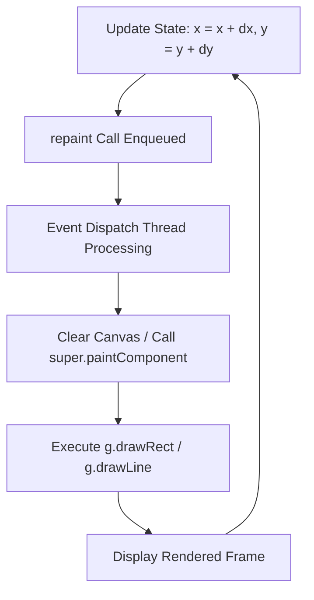

# Class Reflection: Session 4

## Executive Summary
This session explored interactive visual computing in Java, focusing on the mathematical translation of 2D geometry, frame-by-frame coordinate motion, Java Swing rendering pipelines, and modern Git repository directory management.

---

## 1. Mathematical Geometry: Centre vs. Vertex Square Derivation
While default graphics APIs often rely on top-left origin coordinates, manually deriving geometric vertices from a central reference point ($C = (x, y)$) and side length ($l$) ensures precise alignment and rotational transformations.

### Vertex Calculation Algorithm
* **Half-Distance Parameter:** $\text{half} = \frac{l}{2}$
* **Derived Vertices:**
  * **$P_1$ (Top-Left):** $(x - \text{half}, y - \text{half})$
  * **$P_2$ (Top-Right):** $(x + \text{half}, y - \text{half})$
  * **$P_3$ (Bottom-Right):** $(x + \text{half}, y + \text{half})$
  * **$P_4$ (Bottom-Left):** $(x - \text{half}, y + \text{half})$

### Proof of Side Length Equivalence
Horizontal and vertical spans evaluate identically to the specified side length $l$:
$$\Delta x = (x + \text{half}) - (x - \text{half}) = l$$
$$\Delta y = (y + \text{half}) - (y - \text{half}) = l$$

To render a closed polygon using line segments, vertices must be linked sequentially ($P_1 \to P_2 \to P_3 \to P_4 \to P_1$). Omitting the final returning segment ($P_4 \to P_1$) leaves an incomplete boundary.

---

## 2. Motion Logic & Java Swing Rendering Architecture

Motion in 2D graphics is achieved by incrementally mutating positional state variables ($x, y$) over time and signaling the display pipeline to re-render.

