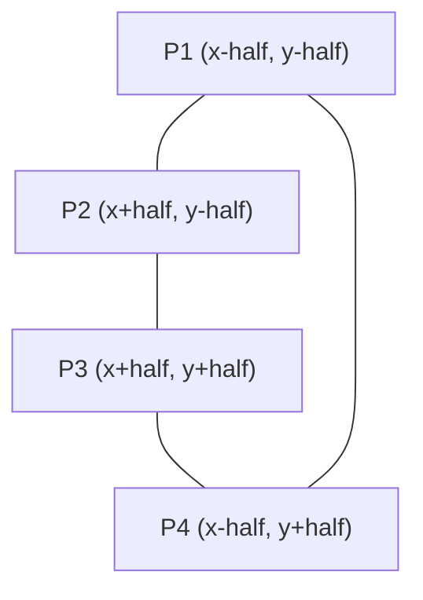

# Class Reflection: Session 4

## Executive Summary
This session centered on computational geometry, real-time visual animation in Java Swing, and standardizing repository architecture with Maven and Git tracking rules.

---

##  Geometric Modeling: Center-Based Square Rendering

When rendering shapes manually using line primitives, calculating vertex coordinates from a center reference point ($C = (x, y)$) provides precise geometric control compared to relying on default top-left offsets.

### Algorithm & Derivation
Given a center $C(x, y)$ and target side length $l$:

$$\text{half} = \frac{l}{2}$$

* **Top-Left ($P_1$):** $(x - \text{half}, y - \text{half})$
* **Top-Right ($P_2$):** $(x + \text{half}, y - \text{half})$
* **Bottom-Right ($P_3$):** $(x + \text{half}, y + \text{half})$
* **Bottom-Left ($P_4$):** $(x - \text{half}, y + \text{half})$

### Side Verification
Calculating the distance between endpoints confirms a consistent side length of $l$:

$$\text{Width} = (x + \text{half}) - (x - \text{half}) = l$$

$$\text{Height} = (y + \text{half}) - (y - \text{half}) = l$$

To form a complete polygon, line segments must connect sequentially in a closed loop ($P_1 \to P_2 \to P_3 \to P_4 \to P_1$).

## Java GUI Ecosystem:

- AWT: Relies on native OS window components, introducing platform-dependent visual variance.

- Swing: Lightweight, pure Java components providing direct access to the Graphics rendering context.

- JavaFX: Modern GUI framework designed for hardware-accelerated rendering and complex UI layouts.

##  Project Structure & Repository Hygiene
Separating raw source files from generated artifacts ensures a clean, predictable project environment across team workflows.

| Directory / File | Purpose | Version Control Action |
| :--- | :--- | :--- |
| `src/main/java` | Core application source code | Tracked by Git |
| `src/test/java` | Test scripts and validation suites | Tracked by Git |
| `pom.xml` | Project Object Model dependency mapping | Tracked by Git |
| `target/` | Compiled bytecodes and build outputs | Ignored via `.gitignore` |
| `.idea/` | IDE environment settings | Ignored via `.gitignore` |

## Excluded Files (.gitignore)

Automated output directories (target/) and environment configs (.idea/) should be declared inside .gitignore to avoid pushing binary bloat and workspace conflicts to the remote repository.

## Conclusion

This session illustrated how mathematical vertex derivations translate into onscreen animations, while highlighting the importance of proper thread lifecycle management and clean Git repository management.
